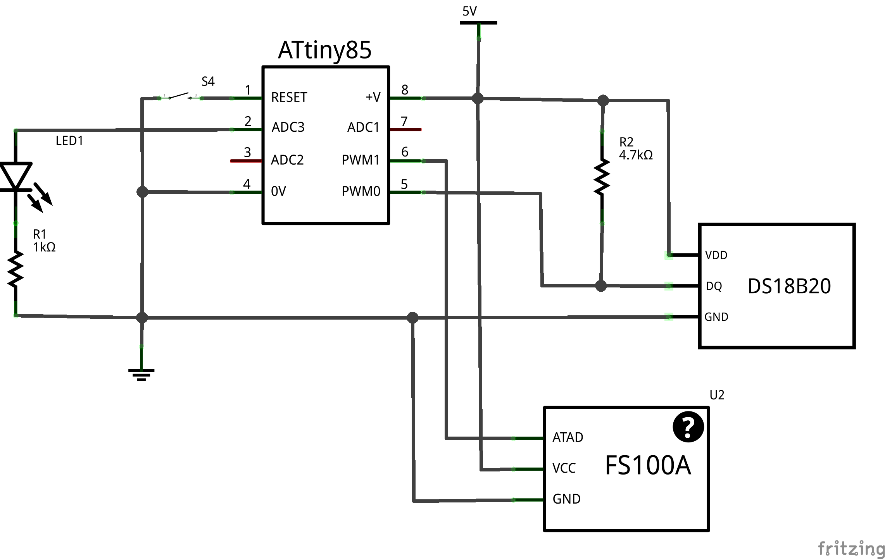

# attiny85_ds18b20_transmitter
RF 433MHz transmitter based on ATtiny85 and DS18B20 digital thermometer

## parts:
* ATtiny85
* DS18B20 1-Wire digital temperature sensor
* FS1000A 433MHz RF transmitter
* 4,7kOm resistor
* 1kOm resistor
* 3mm LED

## Schematics:

